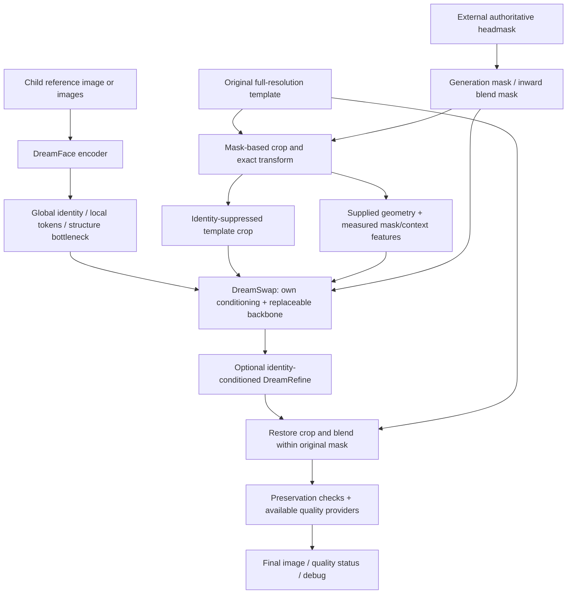

# DreamPage HeadSwap architecture

The implementation is an **initial research and engineering baseline**, not a trained realistic headswap product. It establishes independently executable PyTorch components, a strict template preservation path, trainable identity conditioning, data admission controls, and reproducible evaluation interfaces. No real-world identity, pose, age or realism improvement is claimed. Distinguish passing software tests, synthetic overfit, trained human-face models, and production approval.

## Responsibility boundaries

**Child = identity. Template = geometry, expression, lighting and scene. Supplied headmask = editing authority.** The original full-resolution template remains the final image canvas, outside the generative model's write authority.

The core lives in `src/dreampage_headswap/`; ComfyUI only translates its tensor/node interface. Node graphs, production order scripts and filesystem layout are not part of the learned checkpoint format.

## Contracts and image conventions

`types.py` defines `ChildIdentityInput`, `TemplateInput`, `HeadMask`, `MaskSet`, `TemplateCrop`, `CropTransform`, `IdentityCondition`, `GeometryCondition`, `SwapCondition`, `SwapOutput` and `QualityMetrics`. Image arrays use RGB HWC; model tensors use BCHW in `[0,1]`. References use `B×R×3×H×W`. Unknown age is represented separately from age zero. Unavailable face measurements remain explicitly unavailable.

`CropTransform` stores original height/width, integer clipped XYXY coordinates, left/top/right/bottom padding, model resolution, and derived scale. Point transforms use pixel centers matching resize operations. Crop restoration resizes only the generated patch, then removes recorded padding; it never resamples the whole template.

## Headmask and preservation subsystem

1. Validate finite `[0,1]` values and an exact template-size match. White means editable. Image mask channel selection is explicit; legacy red-channel masks are supported. Alpha is not silently inverted. Empty masks are an unchanged-template fast path; invalid shapes are rejected.
2. Keep three arrays: original authority, configurable generation mask, and blend mask. Expansion/erosion defaults to zero. Expansion may provide additional model context; it **never authorizes final edits outside the original mask**. A deliberately wider production authority must be supplied as a new headmask.
3. Feather inward using a distance transform. Enforce `0 <= blend <= original`; interpolation cannot create new write permission. Face-only/head/head-with-margin labels describe supplied masks and do not trigger automatic detection.
4. Crop around the union of original and generation support, with configurable context and aspect ratio. Pad at image boundaries, preserve exact mapping, and support 512, 768, 1024 or other configured crop sizes.
5. Restore and alpha-composite into a copy of the original array. Protected pixels are copied directly from the original after arithmetic. The promise is equality of decoded pixel arrays where the original mask is zero. It does not promise identical compressed-file bytes, JPEG re-encoding, color-management transforms or downstream page upscaling.

This final compositor is the hard guarantee. Outside-mask losses, latent constraints and a model's compliance can improve seam behavior but cannot substitute for it. A maliciously bad or random generated patch still has no authority to alter the rest of the image.

## DreamFace and proprietary conditioning

`DreamFaceEncoder` is a new trainable convolutional baseline with learned weighting of reference views. It returns a normalized global vector, a pooled **4×4 grid of local tokens**, and a learned structure bottleneck. Default dimensions are 64/64/16. This provides multiple representations and a multi-reference path from the first implementation.

The local tokens are **spatial learned features**, not measured left/right eyes, nose, mouth or facial landmarks. The structure vector is **not an estimated 3D head**. Random initialization cannot recognize a child reliably. Multi-view weighted pooling is implemented; whether it improves identity over one photo requires held-out evaluation and pose-aware training.

The native `IdentityAdapter` constructs a sequence containing global, local and structure tokens. Spatial model features query these tokens through cross-attention, and a mask-gated residual injects the result. This is project-owned trainable conditioning rather than a renamed third-party faceswap model. Its effectiveness remains a research question.

Next encoder experiments should use approved same-identity/different-capture positives, genuine different-identity negatives, held-out identities, and supervised or independently validated anatomy features. An encoder jointly optimized with a generator must not serve as its own sole evaluator: the pair can learn shortcuts or collapse. A separately validated frozen evaluator is required for credible identity ranking.

## Template geometry, appearance and identity leakage

The template's pixels outside the mask provide scene appearance, grain, color and lighting context. Deterministic mask/location and image statistics supply engineering conditioning. Explicit supplied pose/landmark/expression metadata can be represented in `GeometryCondition`; the default system does not secretly load detection/recognition weights. A bounding-box center or mask principal axis is not facial yaw, gaze or expression.

The implemented `MaskContextGeometry` emits four spatial channels (masked X/Y coordinates, mask, protected-region luminance) and a 16-value vector (mask bounds, protected-region mean RGB/availability, supplied yaw/pitch/roll/gaze/openness values and an availability flag). Its measurements retain supplied landmarks for diagnostics; they are not yet a learned landmark heatmap or 3D conditioning path. RGB inside the masked face does not enter its context-statistics channels.

Template identity suppression happens at native resolution before padding or resizing, in both training and inference. Neutral replacement, strong blur, noise and explicit internal-face masking are implemented ablations; pixelation and latent corruption remain future experiments. Geometry uses a separate neutral crop and the original mask. Blur and silhouette can retain target identity. Removing every facial pixel also removes useful expression and lighting cues; a licensed geometry provider or supplied landmarks is necessary to study this tradeoff. Use the same degradation distribution for training and inference, and retain original/degraded crops in debug.

The native sampling path defaults to neutral replacement inside the mask unless an explicitly degraded template condition is supplied. Protected latent anchors are encoded from the sanitized condition too: spatial VAE receptive fields otherwise leak the original face into neighboring latents. The original template is retained for final pixel compositing. Training uses a distinct source capture of the same identity, a degraded target condition, the target headmask and the clean target as supervision. Add true cross-identity held-out swaps so self-reconstruction success cannot conceal template-identity copying.

## Replaceable generative backbones

`GenerativeBackbone` defines `encode_images`, `decode_latents`, `predict_velocity` and `sampling_schedule`. Its mathematical contract is rectified flow: `x_t = (1-t)x_0 + t*epsilon`, target velocity `epsilon-x_0`, with generation integrating from `t=1` to `t=0`. This avoids tying the new stack to FLUX or ComfyUI.

**TinyFlowBackbone** is a small pixel-space trainable network for CPU development. It concatenates noisy RGB, degraded template RGB, headmask and spatial geometry. Time, geometry-vector and optional age features modulate residual convolutional features; the identity cross-attention adapter supplies identity. `DreamSwap` builds the condition, predicts velocity and performs iterative masked reconstruction. This backbone tests gradients, conditioning, checkpoints and end-to-end behavior. It has no pretrained human-face knowledge and is not the proposed final 500M–2B backbone.

**FluxKleinBackbone** is an optional external-backbone integration with new DreamPage conditioning. The target is the non-distilled Apache-2.0 **FLUX.2 Klein BASE 4B**, using an explicitly available local Diffusers snapshot. The existing quantized Qwen GGUF / 9B ComfyUI files are not equivalent to that complete snapshot and are not selected automatically. The heavy model stays behind the interface; native tests need no model download. [BFL training guidance](https://docs.bfl.ai/flux_2/flux2_klein_training), [Diffusers FLUX.2 API](https://huggingface.co/docs/diffusers/api/pipelines/flux2).

The Diffusers contract uses `Flux2Transformer2DModel`, `AutoencoderKLFlux2` and Qwen3 text conditioning. VAE latents require 2×2 channel packing and VAE batch-normalization statistics; the image-token width is 128 for BASE 4B and text/condition width is 7680. Generated and template-reference tokens have separate 4D position IDs. DreamPage identity tokens are projected into conditioning and spatial mask/geometry features have their own learned path. Training calls the transformer directly under autograd, rather than treating the inference pipeline's no-grad call as a trainer. Private packing APIs require compatibility checks against the chosen installed version. [Official BASE 4B transformer config](https://huggingface.co/black-forest-labs/FLUX.2-klein-base-4B/blob/main/transformer/config.json), [Diffusers Klein implementation](https://github.com/huggingface/diffusers/blob/main/src/diffusers/pipelines/flux2/pipeline_flux2_klein.py).

A tiny randomly initialized FLUX transformer test can check these tensor contracts without loading pretrained weights. It cannot demonstrate that the actual BASE 4B runs within the current GPU budget, that adapters transfer identity, or that sampling quality is useful. Those are separate integration and training gates.

## DreamRefine

`DreamRefine` is a separate trainable residual CNN with identity cross-attention, mask gating, a bounded RGB change and zero initialization of its output projection. It initially preserves its input. Bounds reduce the scale of changes but do not certify identity preservation or realistic skin. Refiner training needs paired artifacts, an approved frozen identity teacher, and before/after identity and realism evaluation. No generic beauty, face-restoration or age-changing pretrained weights are silently introduced.

`RefinementSystem` bundles the frozen independently trained DreamFace encoder with the residual model. The serving path uses this exact encoder instead of the generator's potentially different identity representation. `RefinementObjective` combines image reconstruction, boundary/texture losses, source-identity distance and a generated-identity anchor. `RefinementDataset` binds generated artifacts to enrolled pairs by hashes and generator provenance, audits cross-split duplicates, and shares production crop transforms. The separate trainer supports validation, exact resume and best checkpoints. Synthetic execution verifies mechanics only; see `REFINEMENT.md`.

## Data, training and evidence

Explicit JSONL enrollment carries identity, asset paths, provenance, license, consent/permitted usage, optional annotations and splits. Pair validation checks identity leakage and exact/decoded-image duplicates across all supplied manifests. The preprocessing interface accepts externally prepared headmasks and makes optional learned annotation providers explicit. It does not crawl customer orders. Training-set admission and benchmark inference permission remain different uses.

The minimal training loop is for debugging a small paired dataset before scaling. Configurations own model sizes, degradation, resolution, optimizer, accumulation, losses, checkpoints and precision. Native synthetic fixtures are permitted only when clearly labeled. Required proof includes gradients reaching identity inputs/adapter parameters, deterministic seeded experiments, checkpoint resume equivalence, and decreasing fixed evaluation reconstruction error. A decreasing flow loss alone does not prove identity transfer.

Losses should be modular and explicitly report availability. Flow, reconstruction, protected-region and boundary/texture engineering terms can execute without external face weights. Identity, local anatomy, perceptual, yaw/gaze, expression and age terms require meaningful annotations or trained approved providers. Do not label missing terms as successful zero losses or make a random encoder a production identity score. See `TRAINING.md` for the actual implemented loss/config/runner inventory.

The initial `LossSuite` implements flow MSE, masked RGB L1 reconstruction, protected RGB error, a mask-boundary band error, low-frequency lighting statistics, and local high-frequency texture statistics. These last two terms are pixel proxies, not trained realism judgments. Enabling an identity/perceptual/pose/landmark/gaze/expression/age loss without its required differentiable provider raises an error. A separate supervised cross-view identity contrastive objective requires at least two distinct identities in a batch.

The intended scale-up sequence is adapter training → selected transformer layers → partial backbone → full backbone, each justified by the same held-out benchmark. BF16, accumulation and checkpointing help development; multi-GPU, optimizer sharding and production serving must be validated in their actual environments before being advertised as supported capacity. Published consumer-GPU inference/LoRA estimates are not guarantees for this new training graph.

## Evaluation and deployment boundary

Each benchmark case fixes child, template, headmask, seed/config, current result and new result; optional ground truth is separate. Record outputs and configurations with hashes. Compare preservation and boundary artifacts automatically, then add calibrated identity, pose, expression, age and realism providers as available. Missing metrics are `null` with a reason. A quality gate cannot grant a face-quality PASS merely because outside-mask pixels match.

Human ranking must randomize/blind current/new labels and capture identity likeness, realism, template preservation, AI artifacts and integration judgments. Report failure denominators, unavailable metrics, native resolution, timing scope, GPU synchronization and peak VRAM. Save comparison grids without inventing old-system outputs or copying source images into result slots.

The final ComfyUI integration exposes the same core pipeline and diagnostics; it is not a deployment of the current production workflow. Retry status is advisory until a bounded, measured retry policy is implemented. Debug image export is deliberate and local; logs and future external trackers must follow dataset/product retention policies.

## Remaining research, explicitly outside current claims

Semantic anatomy tokens, learned 3D geometry and disentanglement, a validated child identity encoder, trustworthy age/expression evaluators, production-realistic skin refinement, calibrated automated acceptance, distributed scale tests and a new 500M–2B foundation backbone remain future work. The replaceable interfaces make those experiments possible; they do not make those capabilities already trained.
